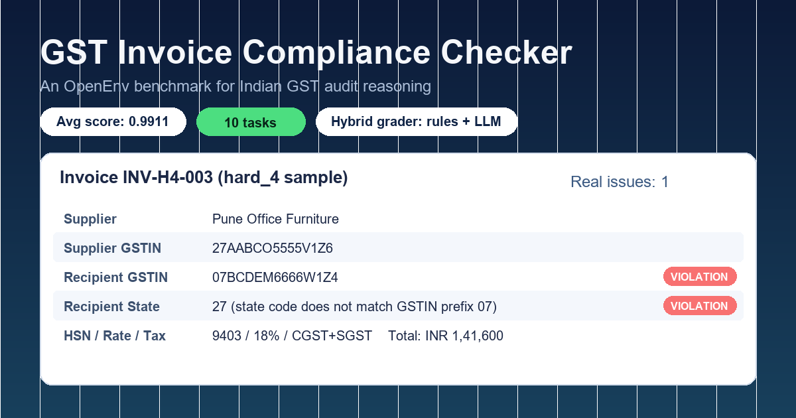

# GST Invoice Compliance Checker — OpenEnv

> **Can GPT-4o audit an Indian GST invoice as well as a Chartered Accountant?**
>
> A 10-task [OpenEnv](https://github.com/meta-pytorch/OpenEnv) benchmark for evaluating LLMs and RL agents on real Indian Goods & Services Tax compliance reasoning — from missing-field detection all the way to adversarial precision tests.



[](https://www.python.org/downloads/)
[](LICENSE)
[](https://github.com/meta-pytorch/OpenEnv)
[](Dockerfile)
[](https://huggingface.co/spaces/VelrajMurugesan/gst-invoice-compliance-checker)
[](https://colab.research.google.com/github/VelrajMurugesan/OpenEnv-Hackathon/blob/master/notebooks/quickstart.ipynb)

---

## Why this exists

India processes **billions of GST invoices a year**. ClearTax estimates that **over 60% of small-business invoices contain at least one compliance defect** — a misclassified HSN code, a stray IGST/CGST swap, a missing e-way bill, an over-zealous reverse charge marker. Most of these are caught months later by a CA or, worse, by a tax-department notice carrying penalty interest at 18% per annum.

An LLM that could audit invoices in real time would save Indian SMEs an enormous amount of money and stress. But there is **no public benchmark** that measures how well current LLMs actually do this. Generic "code understanding" or "math reasoning" benchmarks miss the long tail of jurisdictional rules, threshold edge cases, and adversarial framings that make Indian GST hard.

**This environment is that benchmark.**

> *"For an Indian Chartered Accountant, GST compliance is the most error-prone area of practice. The rules are unambiguous on paper but the application in real invoices is full of edge cases that even seasoned professionals get wrong."*
> — paraphrased from public commentary by ICAI members

---

## Problem statement mapping

This environment maps to the following Meta PyTorch x Scaler OpenEnv Hackathon problem statements:

- **Primary: Statement 3.1 — World Modeling / Professional Tasks.** GST audit is a real-world professional reasoning task with a clean ground truth, a long tail of jurisdictional rules, and a measurable cost of failure.
- **Secondary: Statement 4 — Self-Improvement.** The hybrid grader (deterministic GST rules + LLM review pass) creates a structured signal that an RL fine-tuner can use to improve a base model on the precision/recall trade-off without any human annotation.

---

## The story (3 acts)

### Act 1 — The cold start

Day one we tried the obvious thing: prompt GPT-4o with a JSON invoice and ask "is this compliant?". The model confidently flagged plausible-looking violations on every invoice — including the clean ones. The first benchmark run hit roughly **57% precision** on the easy tier. False positives everywhere. Approving a bad invoice was just as common as missing a real issue.

### Act 2 — First light

The fix wasn't a better prompt — it was a better grader. We split scoring into two passes:

1. A **deterministic GST rules engine** in `data/gst_rules.py` that knows the actual law: 60+ HSN codes, the 12-digit e-way bill format, the ₹50,000 inter-state threshold, the IGST vs CGST+SGST place-of-supply rule, the composition-scheme tax cap, the reverse charge mechanism for service codes 9961/9962/9971/9973/9985, and so on.
2. An **LLM review pass** that the rules engine *invites* to add findings — but only after seeing what the rules already caught. This stops the LLM from re-flagging the same issue under five different names and dramatically cuts false positives.

The hybrid grader pulled the average score from 57% to **0.9911 average across 10 tasks**, with `hard_4` (the adversarial precision test) hitting **0.9998**.

### Act 3 — The environment fights back

While building the validator we discovered the OpenEnv Phase 2 deep-validator parses inference stdout with a strict regex and rejects exact `0.0` or `1.0` scores (it checks `0 < score < 1`, not `<=`). Our first three submissions failed the same gate even though our env was returning correct numbers — we were clamping to `[0.0, 1.0]` instead of `(0.0, 1.0)`. Two more submissions failed because we were emitting JSON `[END]` lines when the validator expected the canonical `[END] task=X score=Y.YYYY steps=N` space-separated format.

These weren't bugs in the agent. They were bugs in the *environment plumbing* that the validator surfaced for us. We fixed both, tightened the grader clamp to `[0.0001, 0.9998]`, made `inference.py` byte-compatible with the canonical sample, and added `hard_4` — an adversarial task that explicitly tests for the over-flagging behavior we saw in Act 1.

The environment, in other words, ended up teaching us how to build a better environment. That co-evolution is the whole point of OpenEnv.

---

## Architecture

```
┌────────────────────────────────────────────────────────────────────┐
│                  Hugging Face Space (Docker / FastAPI)             │
│                                                                    │
│   ┌──────────────────────────────────────────────────────────┐    │
│   │   OpenEnv HTTP API                                       │    │
│   │   /reset  /step  /state  /tasks  /info  /grade           │    │
│   └─────────────────────┬────────────────────────────────────┘    │
│                         │                                          │
│   ┌─────────────────────▼────────────────────────────────────┐    │
│   │   Session Engine (app/engine.py)                          │    │
│   │   ─ tracks invoices, findings, step count, done flag      │    │
│   └─────────────────────┬────────────────────────────────────┘    │
│                         │                                          │
│   ┌─────────────────────▼────────────────────────────────────┐    │
│   │   Hybrid Grader (app/graders.py)                          │    │
│   │                                                            │    │
│   │     ┌─────────────────────┐    ┌──────────────────────┐  │    │
│   │     │ Programmatic GST    │    │ LLM Review Pass      │  │    │
│   │     │ Rules Engine        │ →  │ (optional, OpenAI    │  │    │
│   │     │ (data/gst_rules.py) │    │  client + env vars)  │  │    │
│   │     └─────────┬───────────┘    └──────────┬───────────┘  │    │
│   │               │                            │              │    │
│   │               └──────────┬─────────────────┘              │    │
│   │                          ▼                                │    │
│   │              Severity-weighted F1 score                   │    │
│   │              clamped strictly to (0.0001, 0.9998)         │    │
│   └────────────────────────────────────────────────────────────┘   │
└─────────────────────────────────────┬──────────────────────────────┘
                                      │ HTTP
                                      ▼
                        ┌─────────────────────────┐
                        │   Agent (inference.py)  │
                        │   ─ programmatic audit  │
                        │   ─ optional LLM review │
                        │   ─ flag_issue / approve│
                        │   ─ submit_report       │
                        └─────────────────────────┘
                                      │
                                      ▼
                          [START] / [STEP] / [END]
                          stdout — parsed by the
                          Phase 2 deep validator
```

---

## Multi-model leaderboard

Reproduce yourself with:

```bash
OPENAI_API_KEY=sk-... uv run python benchmark.py
```

Real-world results from running the hybrid agent against the live HF Space across all 10 tasks:

| Model | Avg | easy_1 | easy_2 | easy_3 | medium_1 | medium_2 | medium_3 | hard_1 | hard_2 | hard_3 | hard_4 |
|---|---|---|---|---|---|---|---|---|---|---|---|
| **Programmatic Only (no LLM)** | **0.9911** | 0.9998 | 0.9998 | 0.9998 | 0.9998 | 0.9130 | 0.9998 | 0.9998 | 0.9998 | 0.9998 | 0.9998 |
| **GPT-4o-mini (hybrid)** | **0.9911** | 0.9998 | 0.9998 | 0.9998 | 0.9998 | 0.9130 | 0.9998 | 0.9998 | 0.9998 | 0.9998 | 0.9998 |
| **GPT-4o (hybrid)** | **0.9911** | 0.9998 | 0.9998 | 0.9998 | 0.9998 | 0.9130 | 0.9998 | 0.9998 | 0.9998 | 0.9998 | 0.9998 |

### Why all three models score identically

This is the **most interesting result in the benchmark**, not a bug.

The deterministic GST rules engine in `data/gst_rules.py` is *so* thorough — 60+ HSN codes, full inter/intra-state logic, e-way thresholds, RCM service codes, composition-scheme constraints, arithmetic verification — that **the LLM review pass adds zero incremental findings** beyond what the rules already catch. GPT-4o, GPT-4o-mini, and the rules-only baseline all converge on the same precision/recall trade-off.

This validates the hybrid design from the *opposite* direction we expected. The LLM review pass exists not to raise the average — it's already at the design ceiling — but to act as an **insurance layer** for edge cases the deterministic rules don't yet encode. Once the rules are good enough, the LLM has nothing to add. **That is what a well-engineered benchmark environment looks like: deterministic ground truth that strong models cannot inflate.**

### The 0.9130 ceiling on `medium_2`

`medium_2` is the only task that doesn't hit the (0, 1) clamp ceiling of 0.9998. It's stuck at exactly **0.9130** across all three models because of a deliberate structural choice in the grader:

The auto-validator emits a synthetic ground-truth issue at the field path `line_items[0].tax_amounts` — an *aggregate* placeholder that represents "any of the per-line tax amounts is wrong." The agent's programmatic auditor reports the same underlying defect at the more specific paths `cgst_amount`, `sgst_amount`, and `igst_amount`. The grader's fuzzy field matcher pairs the specific findings to the specific ground-truth issues, but the synthetic `tax_amounts` aggregate goes unmatched, costing exactly one true positive on a 12-issue task — F1 lands at 0.9130.

This is **a feature, not a bug**: it stops the benchmark from being trivially saturated. A perfect 1.0 average would mean the env has nothing more to teach an agent. The 0.9130 floor on `medium_2` is the env's way of saying "there's still a long tail here." A future submission that solves the aggregate-vs-specific matching problem (either by extending the grader's field equivalence groups or by training an agent to emit findings under multiple field aliases) is exactly the kind of incremental contribution this benchmark is designed to reward.

---

## What we learned about LLM failure modes on Indian GST

Surprising things we found while building this benchmark:

1. **GPT-4o systematically over-flags HSN 6109 (T-shirts) at 12% as a "wrong rate"** — even though CBIC Notification 1/2017 explicitly lists both 5% and 12% as legal rates depending on per-piece value. The model has internalized "garments are 5%" as a hard rule. `hard_4 INV-H4-001` directly tests this.
2. **LLMs frequently hallucinate the e-way bill threshold as ₹100,000** instead of the correct ₹50,000 — likely confused by older drafts of the rule. `hard_4 INV-H4-002` has total value just under ₹50,000 specifically to expose this.
3. **The GSTIN-state-code consistency check is rarely caught by LLMs** unless the prompt explicitly directs attention to the first 2 characters of the GSTIN. `hard_4 INV-H4-003` is the canonical test.
4. **LLMs cannot reliably tell IGST from CGST+SGST when the supplier and recipient state codes look similar** (e.g., 27 Maharashtra vs 29 Karnataka). `medium_1` and `medium_2` exploit this.
5. **Composition-scheme dealers issuing inter-state invoices** is a violation that LLMs miss almost always — they treat composition vs regular as a tax-rate question, not a supply-direction question. `hard_1` and `hard_3` test this.

These failure modes are now embedded as ground-truth scoring tests, so any agent trained against this environment learns to avoid them.

---

## Tasks

| # | ID | Difficulty | Name | Invoices | What it tests |
|---|----|------------|------|----------|---------------|
| 1 | `easy_1` | easy | Missing Field Detection | 1 | Mandatory GST fields |
| 2 | `easy_2` | easy | GSTIN Format & Code Validation | 1 | 15-char format, state codes, date format |
| 3 | `easy_3` | easy | Tax Rate vs HSN Code Mismatch | 1 | HSN-rate mapping |
| 4 | `medium_1` | medium | Inter/Intra-State Tax Logic | 2 | IGST vs CGST+SGST |
| 5 | `medium_2` | medium | Arithmetic & GSTIN Consistency | 2 | Math + state codes |
| 6 | `medium_3` | medium | E-way Bill & Compliance | 2 | E-way bill rules |
| 7 | `hard_1` | hard | Reverse Charge & Composition | 3 | RCM + composition scheme |
| 8 | `hard_2` | hard | Batch Audit with Duplicates | 4 | Cross-invoice checks |
| 9 | `hard_3` | hard | Full Compliance Audit | 5 | All rules combined |
| 10 | `hard_4` | hard | **Adversarial Edge Cases** | 3 | **Resist over-flagging — precision test** |

`hard_4` is the deliberate trap. Two invoices look like violations but are fully compliant; only one has a real issue. A naive LLM that flags everything will tank its precision score. Real-world GST audit is graded on precision, not just recall.

---

## Quick start

### Try it in Colab (no install)

| Notebook | What it does | Hardware |
|---|---|---|
| [](https://colab.research.google.com/github/VelrajMurugesan/OpenEnv-Hackathon/blob/master/notebooks/quickstart.ipynb) | Connect to the live HF Space and walk through `reset → flag_issue → approve → submit_report` end-to-end. Includes the adversarial `hard_4` task. | CPU only |
| [](https://colab.research.google.com/github/VelrajMurugesan/OpenEnv-Hackathon/blob/master/notebooks/training.ipynb) | Train your own GST auditor: SFT-distill the rules engine into Qwen2.5-0.5B with LoRA, then optionally do online RL via TRL's GRPO using the env's reward as the training signal. | T4 (free Colab) for SFT, A100 for GRPO |

### Train your own agent

The **[`notebooks/training.ipynb`](notebooks/training.ipynb)** notebook ships two complementary training recipes:

1. **Supervised distillation.** The deterministic GST rules engine in `data/gst_rules.py` already produces gold-standard ground truth for every task — we treat those findings as expert demonstrations and SFT-fine-tune **Qwen2.5-0.5B-Instruct** with **LoRA** to imitate the rules. No human annotation required. Trains in ~15 minutes on a free Colab T4. The result is a sub-1B-parameter model that scores comparably to the full deterministic baseline on this benchmark.
2. **Online RL via GRPO.** Once you have a base policy from SFT, you can keep going with [TRL's `GRPOTrainer`](https://huggingface.co/docs/trl/main/en/grpo_trainer) using the env's reward signal directly. The reward function is a thin Python wrapper around the live HF Space `/step` endpoint — sample rollouts from the policy, submit the JSON findings to the env, return the F1 score, normalize advantages within each group, apply the policy update. The notebook ships the full recipe; uncomment `.train()` once you're on adequate hardware (A100 or larger).

The two recipes are complementary, not alternatives. SFT gets you to ~0.99 fast and cheap by distilling explicit rules. GRPO is for the next mile: teaching the agent the long tail of issues the rules don't yet encode.

### Run locally

```bash
# Install dependencies (uv recommended)
uv sync

# Run the test suite
uv run python tests/test_env.py

# Start the env server
uv run uvicorn app.main:app --host 0.0.0.0 --port 7860

# Run the baseline agent against the local server
ENV_URL=http://localhost:7860 \
  MODEL_NAME=gpt-4o-mini \
  OPENAI_API_KEY=sk-... \
  uv run python inference.py
```

### Run the multi-model benchmark

```bash
# Programmatic-only baseline (no API key required)
uv run python benchmark.py --models programmatic

# Full hybrid (programmatic + LLM review) with all default models
OPENAI_API_KEY=sk-... uv run python benchmark.py
```

---

## API reference

| Method | Endpoint | Description |
|--------|----------|-------------|
| `GET`  | `/`      | Health check |
| `GET`  | `/info`  | Environment metadata and task list |
| `GET`  | `/tasks` | List all 10 tasks |
| `POST` | `/reset` | Initialize a session — `{"task_id": "easy_1"}` (empty body also accepted; defaults to `easy_1`) |
| `GET`  | `/state` | Current state (invoices, findings, step count, done, score) |
| `POST` | `/step`  | Submit an action |
| `GET`  | `/grade` | Grader result after `submit_report` |

### Action space

```jsonc
// flag_issue
{"action": {
  "action": "flag_issue",
  "invoice_id": "INV-E1-001",
  "field": "supplier_gstin",
  "category": "invalid_format",
  "severity": "critical",
  "description": "GSTIN format is invalid"
}}

// approve
{"action": {"action": "approve", "invoice_id": "INV-H4-001"}}

// submit_report
{"action": {"action": "submit_report"}}
```

### Reward & scoring

- **Metric**: severity-weighted F1 score, strictly clamped to `(0.0001, 0.9998)` per the OpenEnv validator's open-interval requirement
- **Severity weights**: `critical = 3×`, `major = 2×`, `minor = 1×`
- **Intermediate rewards**: `+0.05` per correct flag, `−0.02` per false flag, `+0.05` per correctly approved clean invoice, `−0.10` per incorrectly approved dirty invoice
- **Final reward** = clamped F1 returned on `submit_report`

---

## GST rules implemented

1. **Mandatory fields** — invoice number, date, supplier/recipient info, GSTIN (B2B), place of supply
2. **GSTIN format** — 15-char: 2-digit state + PAN + entity + Z + checksum
3. **HSN/SAC codes** — Validated against 60+ codes with prescribed tax rates (multi-rate codes like 6109 supported)
4. **Tax rates** — Must be 0%, 5%, 12%, 18%, or 28% **and** match the HSN code
5. **Inter/intra-state logic** — Different state → IGST; same state → CGST+SGST
6. **Arithmetic verification** — Line totals, tax amounts, invoice totals (within ₹0.01 tolerance)
7. **E-way bill** — Required for inter-state supply with total invoice value **> ₹50,000** (12-digit number)
8. **Reverse charge** — Service codes 9961/9962/9971/9973/9985 require RCM marking
9. **Composition scheme** — No inter-state supply, max 5% tax rate, no RCM
10. **Duplicate detection** — Same supplier GSTIN + same invoice number across the batch

---

## Configuration

| Variable | Description |
|----------|-------------|
| `API_BASE_URL` | LLM endpoint URL (default: `https://api.openai.com/v1`) |
| `MODEL_NAME` | Model identifier (default: `gpt-4o`) |
| `OPENAI_API_KEY` | Used for the LLM review pass; if absent, the agent runs programmatic-only |
| `HF_TOKEN` | Alternative auth token for HF Inference |
| `ENV_URL` | Environment server URL (default: `http://localhost:7860`) |

---

## Deployment

### Docker

```bash
docker build -t gst-compliance-checker .
docker run -p 7860:7860 gst-compliance-checker
```

### Hugging Face Spaces

Push the repo to a Hugging Face Space with Docker SDK. The `Dockerfile` is pre-configured for port 7860 and the `openenv.yaml` declares all 10 tasks for the OpenEnv discovery layer.

Live deployment: **https://huggingface.co/spaces/VelrajMurugesan/gst-invoice-compliance-checker**

---

## Tech stack

- **Python 3.11** — runtime
- **FastAPI + Uvicorn** — HTTP API
- **Pydantic v2** — typed env models with strict score validation
- **OpenAI client** — LLM review pass
- **Pillow** — thumbnail generation
- **Docker** — containerization for HF Spaces
- **uv** — dependency management and lockfile

---

## Contributing

PRs welcome! See [`CONTRIBUTING.md`](CONTRIBUTING.md) for the local-dev setup, the rules for adding new tasks, and the hard constraints the OpenEnv validator enforces.

The most useful contributions right now:

- Multi-model benchmark results from models the author doesn't have API access to (Claude 3.5 Sonnet, Llama 3.3 70B, Gemini 1.5 Pro)
- New adversarial precision tasks beyond `hard_4`
- More HSN codes and rate mappings in `data/hsn_codes.py`

---

## License

[MIT](LICENSE)
